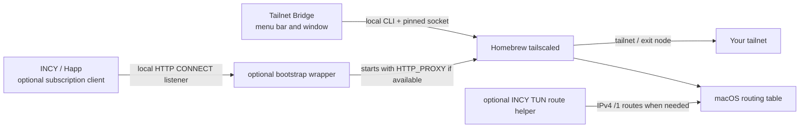

<p align="center"></p>

# Tailnet Bridge for macOS

[](https://github.com/s1ttt/tailnet-bridge-macos/actions/workflows/build.yml)
[](LICENSE)

**An unofficial menu bar companion for the Homebrew `tailscaled` daemon.**
Connect to a tailnet, browse devices, select an exit node, and see whether a
local INCY or Happ bootstrap proxy is available. Built for Apple Silicon and
macOS 15 or later.

> [!IMPORTANT]
> Tailnet Bridge is independent of Tailscale, INCY, and Happ. It does not ship
> a VPN engine, a VLESS/Trojan client, or Tailscale credentials. It controls a
> separately installed Homebrew `tailscaled` through
> `/var/run/tailscaled.socket`. The official Tailscale macOS app is a different
> client and is not controlled by this interface.

[Русская версия](docs/README.ru.md) · [Installation](docs/INSTALL.md) ·
[Networking and limitations](docs/NETWORKING.md) · [Changelog](CHANGELOG.md)

## What you get

- A compact menu bar icon and a three-column window with devices, search, exit
  nodes, account state, settings, and diagnostics.
- A colored **top-left dot** inside the menu bar's 3×3 icon: amber means the
  INCY/Happ app is running without a detected local proxy; green means a local
  TCP listener is available. The Dock icon has a permanent green identity dot.
- Automatic connection without a local proxy when none is detected. With the
  optional wrapper installed, `tailscaled` uses a detected HTTP CONNECT proxy
  on `127.0.0.1:10808`, `:10809`, or `:10820` and falls back to no local proxy
  when those listeners disappear.
- An optional route helper for a specific **INCY TUN + Tailscale exit node**
  setup. It is not installed by the app and is IPv4-only.

The icon checks a listener's TCP port. It does **not** verify proxy auth,
CONNECT behavior, internet access, DNS privacy, or the route to an exit node.

## Quick start

1. Install the Homebrew CLI/daemon: `brew install tailscale` and
   `sudo brew services start tailscale`.
2. Check that `tailscale --socket=/var/run/tailscaled.socket status` can reach
   the daemon (the app uses Homebrew's absolute CLI path).
3. Download `TailscaleMenuBar-v0.6.0-macos-arm64.zip` from
   [Releases](https://github.com/s1ttt/tailnet-bridge-macos/releases), unzip it,
   and move `TailscaleMenuBar.app` to Applications.
4. Open the app. The first launch creates its menu bar icon; opening the app
   again, or choosing **Open Tailnet Bridge**, shows the window. Turn on the
   connection, complete Tailscale sign-in if prompted, and select an exit node
   if desired.

The public preview binary is **ad-hoc signed, not Apple-notarized**. macOS may
require the [Open Anyway flow](https://support.apple.com/guide/mac-help/open-a-mac-app-from-an-unknown-developer-mh40616/mac).
Check the published SHA-256 file before opening the download. See the
[full installation guide](docs/INSTALL.md) for verification, source builds,
service setup, and uninstall instructions.

## How the pieces fit



The app only reads status and sends requested Tailscale commands. Closing the
window keeps the interface in the menu bar; **Quit** exits the interface while
leaving the daemon and VPN state alone. The optional bootstrap wrapper and
route helper are separate root-run services. Review their behavior in
[Networking](docs/NETWORKING.md) before installing them.

## Privacy and scope

This repository contains synthetic examples only. The release app does not
bundle subscriptions, auth keys, tailnet data, route dumps, or the official
Tailscale app's private macOS assets. It reads account and device details from
your local daemon to display them; Tailscale itself handles authentication and
network traffic. There is no project-specific analytics or telemetry endpoint.
The automatic network repair checks reachability with an HTTP request to
`captive.apple.com`, the URL macOS itself probes; turning that setting off
stops it.

The source is [BSD-3-Clause](LICENSE). Fallback icon code adapted from
Tailscale's open-source systray retains its notice in
[Third-party notices](THIRD_PARTY_NOTICES.md). The 3×3 Dock artwork is drawn
locally from code, with a green dot to distinguish this app from the official
client. This project is not endorsed by Tailscale.

## Build and contribute

```sh
./build.sh
./TailscaleMenuBar.app/Contents/MacOS/TailscaleMenuBar --self-test
```

The build requires Xcode Command Line Tools on Apple Silicon macOS 15+.
`./install.sh` rebuilds, backs up an existing app bundle, and installs only
the interface in `/Applications`; it does not install the optional root
services. See [Contributing](CONTRIBUTING.md) for privacy and test guidance.
