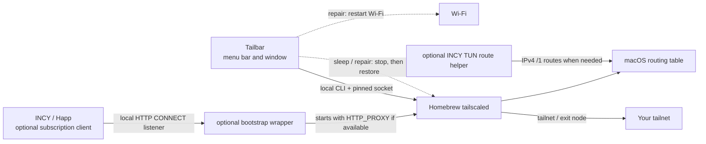

<p align="center"></p>

# Tailbar for macOS

[](https://github.com/s1ttt/tailbar-macos/actions/workflows/build.yml)
[](LICENSE)

**An unofficial menu bar app for the Homebrew `tailscaled` daemon.**
Connect to a tailnet, browse devices, select an exit node, and see whether a
local INCY or Happ bootstrap proxy is available. Tailbar also keeps the
network working across sleep, network changes and VPN client restarts.
Built for Apple Silicon and macOS 15 or later.

> [!IMPORTANT]
> Tailbar is independent of Tailscale, INCY, and Happ. It does not ship
> a VPN engine, a VLESS/Trojan client, or Tailscale credentials. It controls a
> separately installed Homebrew `tailscaled` through
> `/var/run/tailscaled.socket`. The official Tailscale macOS app is a different
> client and is not controlled by this interface.

[Русская версия](docs/README.ru.md) · [Installation](docs/INSTALL.md) ·
[Networking and limitations](docs/NETWORKING.md) · [Changelog](CHANGELOG.md)

## What you get

- A compact menu bar glyph of nine dots: the lit dots form a small bridge
  when connected, add a top dot when an exit node carries your traffic (a
  ring if it does not answer), show a ring in the middle on a health warning,
  and build up dot by dot while connecting. All dots dim means disconnected.
- A three-column window with devices, search, exit
  nodes, account state, settings, and diagnostics.
- A colored **top-left dot** on the menu bar glyph: amber means the
  INCY/Happ app is running without a detected local proxy; green means a local
  TCP listener is available. The Dock icon has a permanent green identity dot.
- **Sleep and wake** (on by default): Tailscale is stopped before the Mac
  sleeps. After wake, Tailbar waits for Wi-Fi and INCY/Happ, then reconnects
  with the same exit node, so a lid close no longer breaks the network.
- **Network health and repair** (on by default): if Wi-Fi is up but the
  internet is not, Tailbar finds out why and fixes it the way you would by
  hand: stop Tailscale, restart Wi-Fi, restore Tailscale. Typical causes are a
  missing default route, a route into a dead tunnel, stale DNS, or a stuck
  exit node. **Reconnect Tailscale** and **Repair Network** are also in the
  menu.
- Automatic connection without a local proxy when none is detected. With the
  optional wrapper installed, `tailscaled` uses a detected HTTP CONNECT proxy
  on `127.0.0.1:10808`, `:10809`, or `:10820` and falls back to no local proxy
  when those listeners disappear.
- An optional route helper for a specific **INCY TUN + Tailscale exit node**
  setup. It is not installed by the app and is IPv4-only.

The top-left dot checks only a listener's TCP port. It does **not** verify
proxy auth, CONNECT behavior, internet access, DNS privacy, or the route to an
exit node.

## Quick start

1. Install the Homebrew CLI/daemon: `brew install tailscale` and
   `sudo brew services start tailscale`.
2. Check that `tailscale --socket=/var/run/tailscaled.socket status` can reach
   the daemon (the app uses Homebrew's absolute CLI path).
3. Download `Tailbar-v0.6.0-macos-arm64.zip` from
   [Releases](https://github.com/s1ttt/tailbar-macos/releases), unzip it,
   and move `Tailbar.app` to Applications.
4. Open the app. The first launch creates its menu bar icon; opening the app
   again, or choosing **Open Tailbar**, shows the window. Turn on the
   connection, complete Tailscale sign-in if prompted, and select an exit node
   if desired.

Upgrading from **Tailnet Bridge 0.5** (`TailscaleMenuBar.app`)? Remove the old
app and turn **Launch at login** on again; see
[Upgrading from 0.5](docs/INSTALL.md#upgrading-from-05-tailnet-bridge--tailscalemenubarapp).

The binary is **ad-hoc signed, not Apple-notarized**. macOS may
require the [Open Anyway flow](https://support.apple.com/guide/mac-help/open-a-mac-app-from-an-unknown-developer-mh40616/mac).
Check the published SHA-256 file before opening the download. See the
[full installation guide](docs/INSTALL.md) for verification, source builds,
service setup, and uninstall instructions.

## How the pieces fit



Tailbar reads status and runs Tailscale commands: the ones you choose, plus
stopping Tailscale before sleep and restoring it afterwards. When network
repair is on, it may also restart Wi-Fi. It never changes routes itself and
needs no administrator rights. Closing the window keeps the interface in the
menu bar. **Quit** exits the interface and leaves the daemon and the current
VPN state as they are; the sleep and repair features then stop until Tailbar
runs again. The optional bootstrap wrapper and route helper are separate
root-run services. Review their behavior in
[Networking](docs/NETWORKING.md) before installing them.

## Privacy and scope

This repository contains synthetic examples only. The release app does not
bundle subscriptions, auth keys, tailnet data, route dumps, or any part of
the official Tailscale app. It reads account and device details from
your local daemon to display them; Tailscale itself handles authentication and
network traffic. There is no project-specific analytics or telemetry endpoint.
The automatic network repair checks reachability with an HTTP request to
`captive.apple.com`, the URL macOS itself probes; turning that setting off
stops it.

The source is [BSD-3-Clause](LICENSE). Tailbar's code and artwork are its
own: the menu bar glyph and the Dock icon are drawn in code
(`TailbarGlyph`, `Resources/GenerateAppIcon.swift`), and the app neither
bundles nor reads any other app's images. See
[Third-party notices](THIRD_PARTY_NOTICES.md).

Tailscale is a trademark of Tailscale Inc. INCY and Happ belong to their
respective owners. Their names appear here only to say what Tailbar works
with. Tailbar is an independent project, not affiliated with, sponsored by,
or endorsed by any of them.

## Build and contribute

```sh
./build.sh
./Tailbar.app/Contents/MacOS/Tailbar --self-test
```

The build requires Xcode Command Line Tools on Apple Silicon macOS 15+.
`./install.sh` rebuilds, backs up an existing app bundle, and installs only
the interface in `/Applications`; it does not install the optional root
services. See [Contributing](CONTRIBUTING.md) for privacy and test guidance.
